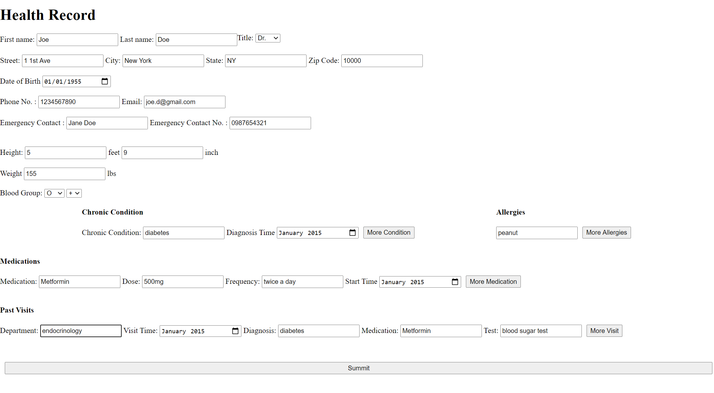
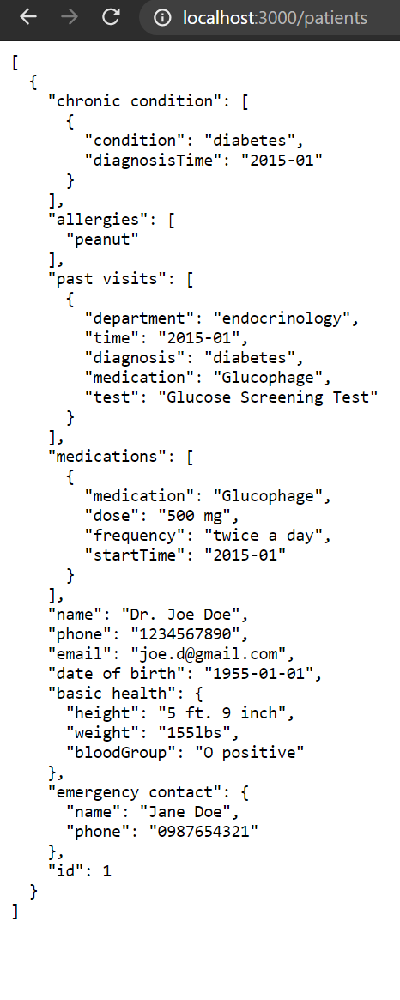

# Health-Record 
With the increasing number of senior citizens, more and more patients need an app which is designed to record patients' health and medication statues and to transfer the information between different health care providers.\
This app is trying to meet the need by collecting patients' information and storing the information to a server. \
### Technology Used
- html
- css
- javascript
- JSON

### How to use

Patients can input their information to the interface. 
By clicking the summit button, the information will send to the JSON server. 

With information stored as JSON file, patients' information can be easily called by patients name or id, and health care providers can just transfer part of the JSON file when it is necessary.  

### future goal

- Provide preview function to generate a preview form before summit.
- Using advanced server to store test result from past visits, like image of CAT scan or video from ultrasound.

